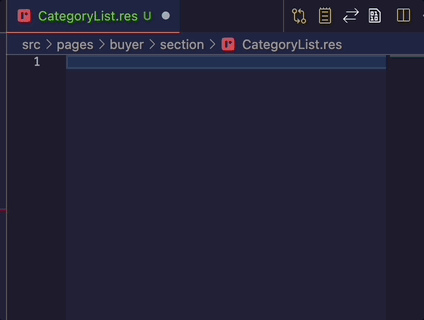
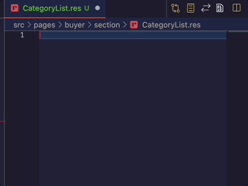

# Rescript-React-snippet

a shorthand snippets for rescript-react

lists of supported snippets:

- rescript
  - `resm` : `Res`cript `M`odule
  - `resmwt` : `Res`cript `M`odule `W`ith its `T`ype
- rescript-react related
  - `rcm` : `R`escript react `C`omponent `M`odule
  - `flc` : `F`ile `L`evel rescript react `C`omponent
  - `rrs` : `R`escript `R`eact `S`tring
  - `rrsb` : `R`escript `R`eact `S`tring with `B`acktick
  - `rrus` : `R`escript `R`eact `U`se`S`tate
  - `rrue0~7` : `R`escript `R`eact `U`se`E`ffect
- [rescript-relay](https://www.npmjs.com/package/rescript-relay) related
  - `rqm` : `R`escript react `Q`uery `M`odule
  - `rmm` : `R`escript react `M`utation `M`odule
  - `rfm` : `R`escript react `F`ragment `M`odule
- [@greenlabs/res-tailwindcss](https://www.npmjs.com/package/@greenlabs/res-tailwindcss) related
  - `twc` : rescript react `T`ail`W`ind`C`ss ppx
  - `twcc` : rescript react `T`ail`W`ind`C`ss ppx with `C`lassname
- [rescript-classnames](https://www.npmjs.com/package/rescript-classnames) related
  - `cnm` : `C`lass`N`ame `M`ake

---

### `rcm` : Rescript react Component Module



```rescript
module $1 = {
  @react.component
  let make = ($2) => {
    $3
  }
}
```

---

### `flc` : File Level Component

```rescript
@react.component
let make = ($1) => {
  $2
}
```

---

### `rrs` : Rescript React String



```rescript
{${1:string}->React.string}
```

---

### `rrsb` : Rescript React String with Backtick

```rescript
{`${1:string}`->React.string}
```

---

### `rqm` : Rescript react relay Query Module

> prerequisite dependencies
>
> - [rescript-relay](https://www.npmjs.com/package/rescript-relay)


```rescript
module Query = %relay(`
  query ${FileName}${_yourQueryName_}Query ($2) {
    $3
  }
`)
```

---

### `rmm` : Rescript react relay Mutation Module

> prerequisite dependencies
>
> - [rescript-relay](https://www.npmjs.com/package/rescript-relay)

```rescript
module Mutation = %relay(`
  mutation ${FileName}${1:_yourMutationName_}Mutation ($2) {
    $3
  }
`)
```

---

### `rfm` : Rescript react relay Fragment Module

> prerequisite dependencies
>
> - [rescript-relay](https://www.npmjs.com/package/rescript-relay)

```rescript
module Fragment = %relay(`
  fragment ${FileName}${_yourFragmentName_}Fragment on ${2:queryName} {
    $3
  }
`)
```

---

### `twc` : Rescript react Tailwind classname

> prerequisite dependencies
>
> - [@greenlabs/res-tailwindcss](https://www.npmjs.com/package/@greenlabs/res-tailwindcss)

```rescript
className=%twc(\"$1\")
```
